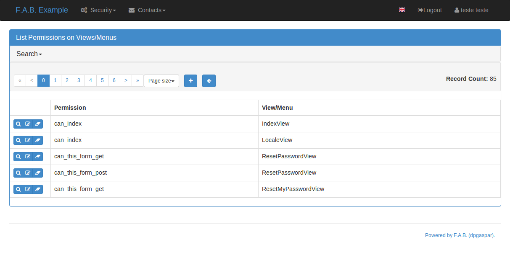

# Security - Flask AppBuilder

## 支持的认证类型

| Type         | Explanation                                                                                                                           |
| ------------ | ------------------------------------------------------------------------------------------------------------------------------------- |
| Database     | 从数据库查询要匹配的用户名和密码样式。密码在数据库中以哈希值保存。                                                                                                     |
| Open ID      | 通过用户的电子邮件使用 Gmail，Yahoo 等进行身份验证。                                                                                                      |
| LDAP         | 针对 LDAP 服务器的身份验证，如 Microsoft Active Directory 。                                                                                       |
| REMOTE\_USER | 读取 _REMOTE\_USER_ 网络服务器环境变量，并验证它是否被框架用户表授权。当服务器（Apache, Nginx）配置为使用 kerberos 时，网络服务器负责对用户进行身份验证。这对于内部网站点很有用，用户不需要在 F.A.B 上使用用户名和密码登录。 |
| OAUTH        | 使用 OAUTH (v1 or v2) 进行认证，需要安装 authlib 。                                                                                               |

在 `config.py` 中配置认证类型，查看 [Base Configuration](https://flask-appbuilder.readthedocs.io/en/latest/config.html) 页面。

会话使用 Flask-Login 保存和加密，OpenID 需要 Flask-OpenID 。

## 认证方法

你可以从 5 种认证方法中选择一种。在 `config.py` 中配置要使用的方法（当使用 create-app 或遵循建议的应用结构时）。首先，为认证方法导入常量：

```python
from flask_appbuilder.security.manager import (
    AUTH_DB,
    AUTH_LDAP,
    AUTH_OAUTH,
    AUTH_OID,
    AUTH_REMOTE_USER
)
```

然后使用 **AUTH\_TYPE** 来选择认证方法：

```python
AUTH_TYPE = AUTH_DB
```

此外，你可以为内置的 Admin 和 Public 权限自定义角色名：

```python
AUTH_ROLE_ADMIN = 'My Admin Role Name'
AUTH_ROLE_PUBLIC = 'My Public Role Name'
```

而且，你可以允许用户自己注册（查看下面的章节了解更多细节）：

```python
AUTH_USER_REGISTRATION = True
AUTH_USER_REGISTRATION_ROLE = "My Public Role Name"
```

以上设置可以应用于所有认证方法。当你使用 `flask fab` 命令行创建第一个 admin 用户时，将使用 `config.py` 中定义的身份认证方法对该用户进行身份认证。

## 身份认证：OAuth

这种方法将使用一个 OAuth Provider 验证用户。

> 注意：想要使用 OAuth 认证，你需要首先安装 [Python AuthLib](https://authlib.org) 。

在 `config.py` 文件中指定允许用户使用的 OAUTH\_PROVIDERS 列表：

```python
AUTH_TYPE = AUTH_OAUTH

# registration configs
AUTH_USER_REGISTRATION = True  # 允许目前不在 FAB DB 中的用户注册
AUTH_USER_REGISTRATION_ROLE = "Public"  # 此角色在 AUTH_ROLES_MAPPING 之外指定

# the list of providers which the user can choose from
OAUTH_PROVIDERS = [
{
    "name": "twitter",
    "icon": "fa-twitter",
    "token_key": "oauth_token",
    "remote_app": {
        "client_id": "TWITTER_KEY",
        "client_secret": "TWITTER_SECRET",
        "api_base_url": "https://api.twitter.com/1.1/",
        "request_token_url": "https://api.twitter.com/oauth/request_token",
        "access_token_url": "https://api.twitter.com/oauth/access_token",
        "authorize_url": "https://api.twitter.com/oauth/authenticate",
    }
},
{
    "name": "google",
    "icon": "fa-google",
    "token_key": "access_token",
    "remote_app": {
        "client_id": "GOOGLE_KEY",
        "client_secret": "GOOGLE_SECRET",
        "api_base_url": "https://www.googleapis.com/oauth2/v2/",
        "client_kwargs": {"scope": "email profile"},
        "request_token_url": None,
        "access_token_url": "https://accounts.google.com/o/oauth2/token",
        "authorize_url": "https://accounts.google.com/o/oauth2/auth",
        "jwks_uri": "https://www.googleapis.com/oauth2/v3/certs",
    }
},
{
    "name": "openshift",
    "icon": "fa-circle-o",
    "token_key": "access_token",
    "remote_app": {
        "client_id": "system:serviceaccount:mynamespace:mysa",
        "client_secret": "<mysa serviceaccount token here>",
        "api_base_url": "https://openshift.default.svc.cluster.local:443",
        "client_kwargs": {"scope": "user:info"},
        "redirect_uri": "https://myapp-mynamespace.apps.<cluster_domain>",
        "access_token_url": "https://oauth-openshift.apps.<cluster_domain>/oauth/token",
        "authorize_url": "https://oauth-openshift.apps.<cluster_domain>/oauth/authorize",
        "token_endpoint_auth_method": "client_secret_post",
    }
},
{
    "name": "okta",
    "icon": "fa-circle-o",
    "token_key": "access_token",
    "remote_app": {
        "client_id": "OKTA_KEY",
        "client_secret": "OKTA_SECRET",
        "api_base_url": "https://OKTA_DOMAIN.okta.com/oauth2/v1/",
        "client_kwargs": {"scope": "openid profile email groups"},
        "access_token_url": "https://OKTA_DOMAIN.okta.com/oauth2/v1/token",
        "authorize_url": "https://OKTA_DOMAIN.okta.com/oauth2/v1/authorize",
        "server_metadata_url": f"https://OKTA_DOMAIN.okta.com/.well-known/openid-configuration",
    }
},
{
    "name": "aws_cognito",
    "icon": "fa-amazon",
    "token_key": "access_token",
    "remote_app": {
        "client_id": "COGNITO_CLIENT_ID",
        "client_secret": "COGNITO_CLIENT_SECRET",
        "api_base_url": "https://COGNITO_APP.auth.REGION.amazoncognito.com/",
        "client_kwargs": {"scope": "openid email aws.cognito.signin.user.admin"},
        "access_token_url": "https://COGNITO_APP.auth.REGION.amazoncognito.com/token",
        "authorize_url": "https://COGNITO_APP.auth.REGION.amazoncognito.com/authorize",
    }
},
{
    "name": "keycloak",
    "icon": "fa-key",
    "token_key": "access_token",
    "remote_app": {
        "client_id": "KEYCLOAK_CLIENT_ID",
        "client_secret": "KEYCLOAK_CLIENT_SECRET",   
        "api_base_url": "https://KEYCLOAK_DOMAIN/realms/master/protocol/openid-connect",
        "client_kwargs": {
            "scope": "email profile"
        },
        "access_token_url": "KEYCLOAK_DOMAIN/realms/master/protocol/openid-connect/token",
        "authorize_url": "KEYCLOAK_DOMAIN/realms/master/protocol/openid-connect/auth",
        "request_token_url": None,
    }
},
{
    "name": "keycloak_before_17",
    "icon": "fa-key",
    "token_key": "access_token",
    "remote_app": {
        "client_id": "KEYCLOAK_CLIENT_ID",
        "client_secret": "KEYCLOAK_CLIENT_SECRET",   
        "api_base_url": "https://KEYCLOAK_DOMAIN/auth/realms/master/protocol/openid-connect",
        "client_kwargs": {
            "scope": "email profile"
        },
        "access_token_url": "KEYCLOAK_DOMAIN/auth/realms/master/protocol/openid-connect/token",
        "authorize_url": "KEYCLOAK_DOMAIN/auth/realms/master/protocol/openid-connect/auth",
        "request_token_url": None,
    }
},
{
    "name": "azure",
    "icon": "fa-windows",
    "token_key": "access_token",
    "remote_app": {
        "client_id": "AZURE_APPLICATION_ID",
        "client_secret": "AZURE_SECRET",
        "api_base_url": "https://login.microsoftonline.com/AZURE_TENANT_ID/oauth2",
        "client_kwargs": {
            "scope": "User.read name preferred_username email profile upn",
            "resource": "AZURE_APPLICATION_ID",
        },
        "request_token_url": None,
        "access_token_url": "https://login.microsoftonline.com/AZURE_TENANT_ID/oauth2/token",
        "authorize_url": "https://login.microsoftonline.com/AZURE_TENANT_ID/oauth2/authorize",
    }
}
]
```

这里需要做一点解释，基本上来说有以下 5 个关键字：

| Key           | Explanation                                                                                                                                                                                                 |
| ------------- | ----------------------------------------------------------------------------------------------------------------------------------------------------------------------------------------------------------- |
| name          | OAuth Provider 的名称，你可以指定任意你想要使用的名称；但 FAB 为以下名称编写好了 `BaseSecurityManager.get_oauth_user_info()` 逻辑：`azure` ，`github` ，`google` ，`keycloak` ，`keycloak_before_17` ，`linkedin` ，`okta` ，`openshift` ，`twitter` |
| icon          | OAuth Provider 的 font-awesome 图标                                                                                                                                                                            |
| token\_key    | OAuth Provider 使用的 token key 名称，默认情况下为 `oauth_token`                                                                                                                                                        |
| token\_secret | OAuth Provider 使用的 token secret key 名称，默认情况下为 `oauth_token_secret`                                                                                                                                          |
| remote\_app   | OAuth Provider API 的配置                                                                                                                                                                                      |

你可以基于 OAuth 群组来给 FlaskAppBuilder 定义角色：

```python
# 注意，目前只有 azure 和 okta 本地支持这个功能
# 但是，如果你自定义了 userinfo 检索以包含 'role_keys'，就可以适用于其他 providers

# userinfo["role_keys"] 到 FAB 角色的映射规则
AUTH_ROLES_MAPPING = {
    "FAB_USERS": ["User"],
    "FAB_ADMINS": ["Admin"],
}

# 是否在每次登录时替换所有用户的角色，或仅在注册时
AUTH_ROLES_SYNC_AT_LOGIN = True

# 强制用户在 30 分钟不活动后重新认证（以保证角色同步）
PERMANENT_SESSION_LIFETIME = 1800
```

如果想要自定义 userinfo 检索，你可以创建自己的 `user_info_getter` 方法如下：

```python
@appbuilder.sm.oauth_user_info_getter
def my_user_info_getter(sm, provider, response=None):
    if provider == "okta":
        me = sm.oauth_remotes[provider].get("userinfo")
        log.debug("User info from Okta: {0}".format(me.data))
        return {
            "username": "okta_" + me.data.get("sub", ""),
            "first_name": me.data.get("given_name", ""),
            "last_name": me.data.get("family_name", ""),
            "email": me.data.get("email", ""),
            "role_keys": me.data.get("groups", []),
        }
    if provider == "aws_cognito":
        me = self.appbuilder.sm.oauth_remotes[provider].get("userInfo")
        return {
            "username": me.json().get("username"),
            "email": me.json().get("email"),
            "first_name": me.json().get("given_name", ""),
            "last_name": me.json().get("family_name", ""),
            "id": me.json().get("sub", ""),
            "role_keys": ["User"], # set AUTH_ROLES_SYNC_AT_LOGIN = False
        }
    else:
        return {}
```

自 Flask-AppBuilder 3.4.0 之后，登录页面变为如下的样式：

With one provider:


With multiple providers:


注意，在 Flask-AppBuilder 3.3.X 版本，会自动跳转到 provider 的允许页面。

使用 SecurityManager 的 `oauth_user_info_getter` 装饰器修饰你的方法。你的方法应该返回一个包含 userinfo 的字典，其中的键具有与 User Model 相同的列名，方法将在用户获得了 OAuth Provider 授权之后调用，查看 [example](https://github.com/dpgaspar/Flask-AppBuilder/tree/master/examples/oauth) 。

你还可以使用 OAuth Provider APIs：可以做到发送 tweets，发布 Facebook，检索用户的 LinkedIn 个人资料等。查看 [example](https://github.com/dpgaspar/Flask-AppBuilder/tree/master/examples/oauth) 了解它的简单用法。

## 身份认证：速率限制

为了防止暴力破解凭证，你可以在 4.2.0 版本中对 AuthViews 应用速率限制，例如限制每 20 秒只能发出 10 个POST请求。这可以通过将 `AUTH_RATE_LIMITED` 和 `RATELIMIT_ENABLED` 设置为 `True` 来启用；通过调整 `AUTH_RATE_LIMIT` 来改变速率，比如将其设置为 `1 per 10 seconds` 。查看 Flask-Limiter 的[文档](https://flask-limiter.readthedocs.io/en/stable/)以获得更多选项和示例。

## 基于角色的安全管理

每个用户可以有多个角色，一个角色拥有视图/API和菜单的权限，所以用户可以拥有视图/API和菜单的权限。

角色可以是用户定义的（由后端支持），也可以是内置只读的。内置只读角色支持视图/API和权限的正则表达式，这简化了安全管理并提高了性能，因为角色权限之间的多对多关系且权限不需要从后端获取。

内置角色在配置文件中通过 `FAB_ROLES` 定义，并且遵循以下数据结构：

```python
FAB_ROLES = {
    "<ROLE NAME>": [
        ["<VIEW/MENU/API NAME>", "PERMISSION NAME"],
        # ...
    ],
    # ...
}
```

例如，配置一个 **Read Only** 角色是这样子的：

```python
FAB_ROLES = {
    "ReadOnly": [
        [".*", "can_list"],
        [".*", "can_show"],
        [".*", "menu_access"],
        [".*", "can_get"],
        [".*", "can_info"]
    ]
}
```

这些角色被自动插入到数据库中（只插入了它们的名称），并且可以像“普通”的用户定义的角色一样与用户关联。

如果你希望稍后更改这些角色的名称，可以通过后端 id 映射这些角色：

```python
FAB_ROLES = {
    "ReadOnly_Altered": [
        [".*", "can_list"],
        [".*", "can_show"],
        [".*", "menu_access"],
        [".*", "can_get"],
        [".*", "can_info"]
    ]
}

FAB_ROLES_MAPPING = {
    1: "ReadOnly_Altered"
}
```

有两种特定的角色，你可以在 [Base Configuration](https://flask-appbuilder.readthedocs.io/en/latest/config.html) 中定义它们的名字：

| Role        | Explanation                                                 |
| ----------- | ----------------------------------------------------------- |
| Admin Role  | 特殊的内置只读角色，将具有全部访问权限。                                        |
| Public Role | 这是一个针对非认证用户的特殊角色，你可以将视图和菜单的任意权限分配给该角色，并且每个人都将可以访问应用程序的特定部分。 |

当然，你可以创建任何您想要的其他角色，并按照喜欢的方式配置它们。

## 权限

FAB 框架通过“检查”你的代码，自动为你创建视图、API或菜单上所有可能存在的权限。

每次你基于 model 新建一个视图时（继承 ModelView），FAB 会为你创建以下权限：

* can list
* can show
* can add
* can edit
* can delete
* can download

创建 CRUD REST API 时：

* can get
* can put
* can post
* can delete
* can info

这些基础权限会关联到你的视图或 API，也就是说，当你创建一个名为 `MyModelView` 的视图时，你可以将以下权限分配给任意角色：

* can list on MyModelView
* can show on MyModelView
* can add on MyModelView
* can edit on MyModelView
* can delete on MyModelView
* can download on MyModelView

当你开发一个名为 `MyApi` 的后端 REST API 时（ `ModelRestApi` 的子类），会生成以下权限：

* can get on MyApi
* can put on MyApi
* can post on MyApi
* can delete on MyApi
* can info on MyApi

如果你通过 `@expose` 装饰器来披露一些用来扩展你的视图的方法，并且想保护这些方法，可以使用 `@has_access` 装饰器：

```python
class MyModelView(ModelView):
    datamodel = SQLAInterface(Group)

    @has_access
    @expose('/mymethod/')
    def mymethod(self):
        # do something
        pass
```

FAB 框架会根据你的方法名创建如下权限：

* can mymethod on MyModelView

如果不需要为一组方法创建细粒度的权限，你可以使用 `@permission_name` 装饰器来将一组方法聚合到单个权限中，，这样做可以简化安全配置。使用 `@permission_name` 可以将权限名重写为你喜欢的任何名称。

查看 [API Reference](https://flask-appbuilder.readthedocs.io/en/latest/api.html) 。

### 自定义权限

默认的视图/菜单，权限是高度细化的，这是一个很好的默认设置，因为它支持高级别的自定义，但在中型到大型应用程序中，生成的权限对的数量可能会让人望而生畏。你可以完全自定义生成的权限名称，如果你希望聚合它们：

```python
class OneApi(ModelRestApi):
    datamodel = SQLAInterface(Contact)
    class_permission_name = "api"

class TwoApi(ModelRestApi):
    datamodel = SQLAInterface(Contact)
    class_permission_name = "api"
```

前面的示例将生成默认权限的一半，只创建以下内容：

* can get on api
* can put on api
* can post on api
* can delete on api
* can info on api

属性 `class_permission_name` 也可以在 BaseViews 和它们的子类中使用，如 `ModelView` ，`MultipleView` ，`MasterDetailView` ，`FormView` 等。

还可以使用 `method_permission_name` 属性聚合方法权限。使用下面的 `Dict` 结构：

```python
method_permission_name = {
    "<METHOD_NAME>": "<PERMISSION_NAME>",
    # ...
}
```

例如：

```python
class OneApi(ModelRestApi):
    datamodel = SQLAInterface(Contact)
    class_permission_name = "api"
    method_permission_name = {
        "get_list": "access",
        "get": "access",
        "post": "access",
        "put": "access",
        "delete": "access",
        "info": "access"
    }

class TwoApi(ModelRestApi):
        datamodel = SQLAInterface(Contact)
        class_permission_name = "api"
        method_permission_name = {
            "get_list": "access",
            "get": "access",
            "post": "access",
            "put": "access",
            "delete": "access",
            "info": "access"
        }
```

现在 FAB 只会生成一个权限对：

* can access on api

如果你想要恢复你的权限名称覆盖，或者再次更改它们，你需要提示 FAB 上一个权限是什么，以便安全收敛(converge)过程知道该做什么：

```python
class OneApi(ModelRestApi):
    datamodel = SQLAInterface(Contact)
    class_permission_name = "OneApi"
    previous_class_permission_name = "api"
    method_permission_name = {
        "get_list": "get",
        "get": "get",
        "post": "post",
        "put": "put",
        "delete": "delete",
        "info": "info"
    }
    previous_method_permission_name = {
        "get_list": "access",
        "get": "access",
        "post": "access",
        "put": "access",
        "delete": "access",
        "info": "access"
    }
```

一个使用 MVC 模型视图压缩权限的例子：

```python
class OneView(ModelView):
    datamodel = SQLAInterface(Contact)
    class_permission_name = "view"
    method_permission_name = {
        'add': 'write',
        'delete': 'write',
        'download': 'write',
        'edit': 'write',
        'list': 'read',
        'muldelete': 'write',
        'show': 'read',
        'api': 'read',
        'api_column_add': 'write',
        'api_column_edit': 'write',
        'api_create': 'write',
        'api_delete': 'write',
        'api_get': 'read',
        'api_read': 'read',
        'api_readvalues': 'read',
        'api_update': 'write'
    }
```

注意，如果要更改一个已经存在的应用程序，则需要将旧的权限名称迁移到新的权限名称。在此之前，应该禁用启动时的自动创建/删除权限操作，即设置 `FAB_UPDATE_PERMS = False` ，然后执行以下 FAB cli 命令：

```shell
$ flask fab security-converge
```

安全收敛(converge)将把所有权限从以前的名称迁移到当前名称，并更改所有角色，因此可以顺利迁移到新的安全命名。在收敛过程之后，你可以删除所有设置过的 `previous_*` 属性。

你还可以通过将 `previous_*` 属性切换到其目标来迁移回去，即切换 `method_permission_name` 到 `previous_method_permission_name` ，以及切换 `class_permission_name` 到 `previous_class_permission_name` 。然后运行安全收敛将扩展至所有角色的所有权限。

> 注意：你应该在进行权限迁移前备份你的生产环境数据库；你还可以运行 `flask fab security-converge --dry-run` 来获得实际收敛过程中将会执行的一系列操作。

## 自动清理

所有的权限和视图会被自动添加到后端并关联到 `Admin` 角色，删除它们时也会清除这些关联。但是，如果你更改了视图或菜单的名称，FAB 框架会添加新的视图和菜单名称到后端，但不会删除旧的那些。这会导致安全模型中生成了不需要的名称，也就是垃圾，需要使用 `security_cleanup` 方法来清理它们。

使用 `security_cleanup` 并非总是必要的，但在重写代码后使用它，将保证权限以及与菜单和视图相关的权限确实存在于你的应用程序中，防止孤立的权限名称和关联。

在注册完所有视图后使用清理操作：

```python
appbuilder.add_view(GroupModelView, "List Groups", category="Contacts")
appbuilder.add_view(ContactModelView, "List Contacts", category="Contacts")
appbuilder.add_separator("Contacts")
appbuilder.add_view(ContactChartView, "Contacts Chart", category="Contacts")
appbuilder.add_view(ContactTimeChartView, "Contacts Birth Chart", category="Contacts")

appbuilder.security_cleanup()
```

你可以随时使用它，一切都将是无伤的自动的。但如果你只在需要时使用它（更改类名，在代码中添加 `security_cleanup` ，无用的名称被删除，然后删除该方法），那么启动程序时不会增加开销。

## 行为记录

所有用户的创建和修改都会被记录。在每个用户的显示详细信息中，可以检查谁在何时创建了该用户，以及谁在何时上次更改了该用户。

你还可以检查总登录次数（成功登录）和最后的失败登录（如果成功登录，这些将被重置）。

如果使用了 SQLAlchemy ，可以以一种简单的方式将行为记录合并到模型中。将 AuditMixin 类混合到模型中：

```python
from flask_appbuilder.models.mixins import AuditMixin
from flask_appbuilder import Model
from sqlalchemy import Column, Integer, String

class Project(AuditMixin, Model):
    id = Column(Integer, primary_key=True)
    name = Column(String(150), unique=True, nullable=False)
```

这将在你的模型中添加以下列：

* created\_on：记录创建的日期和时间
* changed\_on：记录最后更新的日期和时间
* created\_by：谁创建了这条记录
* changed\_by：谁最后修改了这条记录

这些列将在创建或更新记录时由框架自动更新。因此，你应该将它们排除在添加和编辑表单之外。使用我们的示例，您将像这样定义视图：

```python
class ProjectModelView(ModelView):
    datamodel = SQLAInterface(Project)
    add_columns = ['name']
    edit_columns = ['name']
```

## 密码复杂度验证

该特性仅在使用 AUTH 数据库时发挥作用。默认情况下，你可以通过设置 `FAB_PASSWORD_COMPLEXITY_ENABLED = True` 来启用密码复杂度验证。

密码复杂度验证默认强制要求：

* 最少 2 个大写字符
* 最少 2 个小写字符
* 最少 1 个特殊字符
* 最少 2 个数字
* 最少 10 个字符

如果你想要设置自己的密码复杂度验证，可以自定义验证方法，例如在你的配置文件中：

```python
from flask_appbuilder.exceptions import PasswordComplexityValidationError

def custom_password_validator(password: str) -> None:
    """
    一个密码验证器的简单示例
    """
    if len(password) < 8:
        raise PasswordComplexityValidationError("Must have at least 8 characters")

FAB_PASSWORD_COMPLEXITY_VALIDATOR = custom_password_validator
FAB_PASSWORD_COMPLEXITY_ENABLED = True
```

## 自定义安全管理

如果你想要更改安全视图或自 1.0.1 以来的身份认证方法，可以通过一种简单的方式：**AppBuilder** 有一个新的可选初始化参数，你可以在其中传递自定义的 **SecurityManager** 。例如，如果你想要向用户列表添加操作，可以使用下面这种简单的方式来完成。

首先，我建议你创建一个 `security.py` 文件并在其中添加：

```python
from flask import redirect
from flask_appbuilder.security.views import UserDBModelView
from flask_appbuilder.security.sqla.manager import SecurityManager
from flask_appbuilder.actions import action

class MyUserDBView(UserDBModelView):
    @action("muldelete", "Delete", "Delete all Really?", "fa-rocket", single=False)
    def muldelete(self, items):
        self.datamodel.delete_all(items)
        self.update_redirect()
        return redirect(self.get_redirect())

class MySecurityManager(SecurityManager):
    userdbmodelview = MyUserDBView
```

然后在 `__init__.py` 中用你自己的 security 类初始化 AppBuilder ：

```python
appbuilder = AppBuilder(app, db.session, security_manager_class=MySecurityManager)
```

或者，从 1.13.1 开始，你可以在配置中声明自定义 **SecurityManager** 。如果你使用工厂应用模式，则必须使用这种配置方法：

```python
FAB_SECURITY_MANAGER_CLASS='app.security.MySecurityManager'
```

对不同的认证方法，FAB 使用不同的用户视图：

* UserDBModelView: For database auth method
* UserOIDModelView: For Open ID auth method
* UserLDAPModelView: For LDAP auth method

您可以扩展或从头开始创建自己的用户视图，然后通过覆盖它们在 **SecurityManager** 中对应的属性（就像给定的示例一样）告诉 FAB 使用它们。

查看并运行示例：[Employees example](https://github.com/dpgaspar/Flask-AppBuilder/tree/master/examples/employees) 。

学习源码：[BaseSecurityManager](https://github.com/dpgaspar/Flask-AppBuilder/blob/master/flask\_appbuilder/security/manager.py) 。

### 扩展用户模型

如果你想用特定于你的应用程序的额外列扩展用户模型（自 1.3.0 开始），你可以很容易地做到这一点，使用与之前介绍的相同的办法。

First extend the User Model (create a sec\_models.py file):: 首先扩展用户模型（创建一个 `sec_models.py` 文件）：

```python
from flask_appbuilder.security.sqla.models import User
from sqlalchemy import Column, Integer, ForeignKey, String, Sequence, Table
from sqlalchemy.orm import relationship, backref
from flask_appbuilder import Model

class MyUser(User):
    __tablename__ = 'ab_user'
    extra = Column(String(256))
```

然后定义一个新的用户视图，就像默认的用户视图一样，只不过多了一个额外的列（创建一个 `sec_views.py` 文件）：

* AUTH\_DB: Extend UserDBModelView
* AUTH\_LDAP: Extend UserLDAPModelView
* AUTH\_REMOTE\_USER: Extend UserRemoteUserModelView
* AUTH\_OID: Extend UserOIDModelView
* AUTH\_OAUTH: Extend UserOAuthModelView

所以如果你使用的是 AUTH\_DB ：

```python
from flask_appbuilder.security.views import UserDBModelView
from flask_babel import lazy_gettext

class MyUserDBModelView(UserDBModelView):
    """
        添加了特定 DB 的用户视图：
        重写来实现你自定义的视图
        然后在 SecurityManager 中覆盖 userdbmodelview 属性
    """

    show_fieldsets = [
        (lazy_gettext('User info'), 
        {'fields': ['username', 'active', 'roles', 'login_count', 'extra']}),
        (lazy_gettext('Personal Info'),
        {'fields': ['first_name', 'last_name', 'email'], 'expanded': True}),
        (lazy_gettext('Audit Info'),
        {'fields': ['last_login', 'fail_login_count', 'created_on','created_by', 'changed_on', 'changed_by'], 'expanded': False})
    ]

    user_show_fieldsets = [
        (lazy_gettext('User info'),
        {'fields': ['username', 'active', 'roles', 'login_count', 'extra']}),
        (lazy_gettext('Personal Info'),
        {'fields': ['first_name', 'last_name', 'email'], 'expanded': True}),
    ]

    add_columns = [
        'first_name',
        'last_name',
        'username',
        'active',
        'email',
        'roles',
        'extra',
        'password',
        'conf_password'
    ]
    list_columns = [
        'first_name',
        'last_name',
        'username',
        'email',
        'active',
        'roles'
    ]
    edit_columns = [
        'first_name',
        'last_name',
        'username',
        'active',
        'email',
        'roles',
        'extra'
    ]
```

然后创建你自己的 SecurityManager 类，覆盖用户模型和视图（创建一个 `sec.py` 文件）：

```python
from flask_appbuilder.security.sqla.manager import SecurityManager
from .sec_models import MyUser
from .sec_views import MyUserDBModelView

class MySecurityManager(SecurityManager):
    user_model = MyUser
    userdbmodelview = MyUserDBModelView
```

注意上面的示例针对 AUTH\_DB ，如果你使用：

* AUTH\_DB: Override userdbmodelview
* AUTH\_LDAP: Override userldapmodelview
* AUTH\_REMOTE\_USER: Override userremoteusermodelview
* AUTH\_OID: Override useroidmodelview
* AUTH\_OAUTH: Override useroauthmodelview

最后（如上一个示例所示）告诉 F.A.B. 去使用你自己的 SecurityManager 类，所以在 `__init__.py` 中初始化 **AppBuilder** 时：

```python
from flask import Flask
from flask_appbuilder import SQLA, AppBuilder
from flask_appbuilder.menu import Menu
from .sec import MySecurityManager

app = Flask(__name__)
app.config.from_object('config')
db = SQLA(app)
appbuilder = AppBuilder(app, db.session, menu=Menu(reverse=False), security_manager_class=MySecurityManager)

from app import views
```

现在，您将使用扩展的用户模型作为认证用户，_g.user_ 将使用带有 _extra_ 列的模型：


